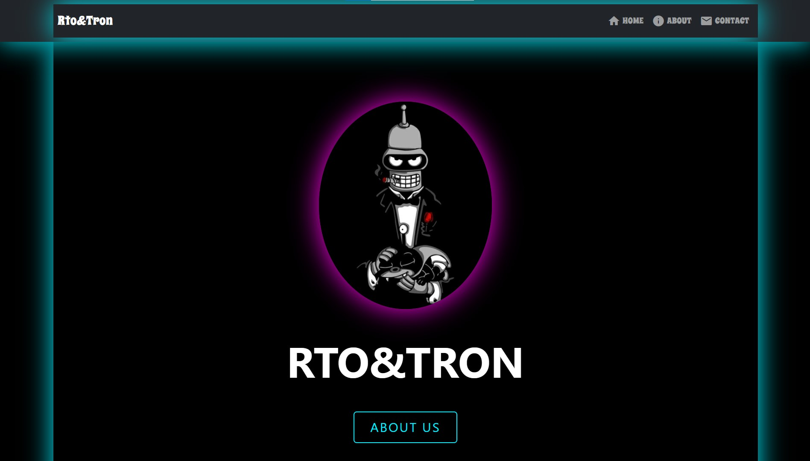

## My First Nodejs/Express Website

This is the repository of a very simple real nodejs project
The purpose of this code, is to give to know all the code
and the reason why I choose certain modules.



### I have learned

- How to start a nodejs project
- How to create routes for a server application
- How to use a template engine like ejs, handlebars, pug, etc.
- Call Assets from CDNs and use static files
- Divide content using partials feature from Template engines
- Deploys the application using a simple service named Now(A service from Zeit Company)

### Installation

My, clone the repo

```sh
git clone https://github.com/Leonmarino2003/my-nodejs-page
```

move to the folder

```sh
cd rto&tron
```

install dependencies:

```sh
npm install
```

execute the project

```sh
npm run dev
```
